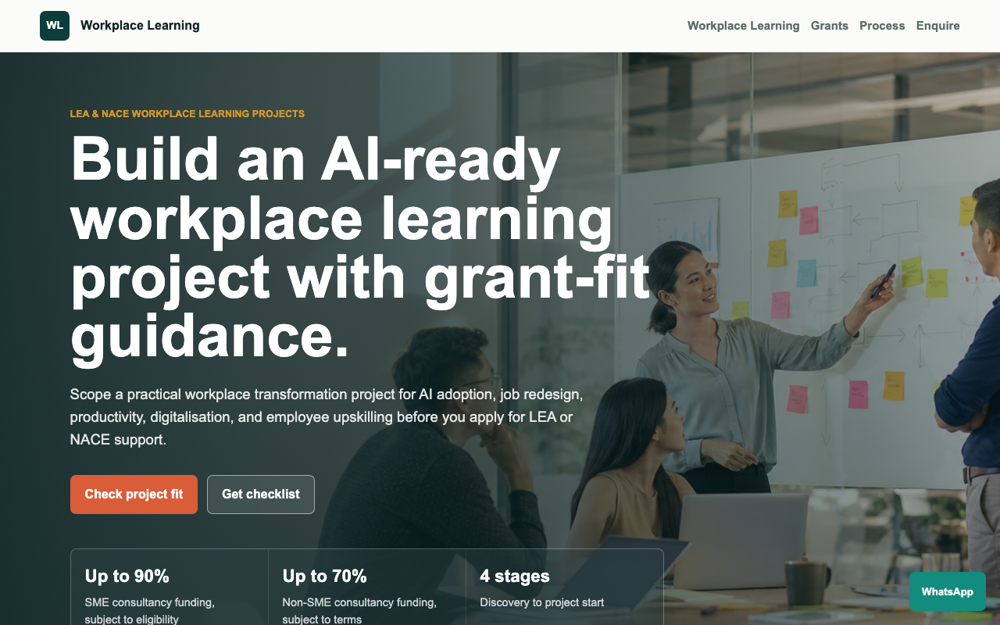

<div align="center">

# Workplace Learning

[](#tech-stack)
[](#n8n-workflow)
[](#deployment)
[](LICENSE)

**LEA and NACE workplace learning project website for Singapore enterprises exploring AI transformation, job redesign, and grant-fit discovery.**

[Live Demo](https://alfredang.github.io/workplacelearning/) · [Report Bug](https://github.com/alfredang/workplacelearning/issues) · [Request Feature](https://github.com/alfredang/workplacelearning/issues)

</div>

## Screenshot



## About

Workplace Learning is a single-page lead generation website for LEA and NACE workplace learning enquiries. It explains workplace learning, AI transformation, job redesign, grant pathways, the consultation process, testimonials, and enquiry options in one static site.

The enquiry form posts directly to a published n8n webhook, which formats the lead, scores it, emails the enquiry to `angch@tertiaryinfotech.com`, and returns a JSON success response to the browser.

## Features

- SEO-focused landing page for LEA and NACE workplace learning searches
- Hero section with generated workplace transformation visual
- Workplace learning, AI transformation, and job redesign content
- LEA/NACE grant-fit explanation with careful eligibility wording
- Visual process timeline from discovery to project start
- Lead magnet CTA for a Workplace Learning Grant-Fit Checklist
- Testimonials and WhatsApp floating enquiry widget
- Static enquiry form integrated with n8n
- Published n8n workflow with formatted HTML email and lead scoring
- GitHub Pages workflow for static deployment

## Tech Stack

| Layer | Technology |
| --- | --- |
| Frontend | HTML, CSS, JavaScript |
| Automation | n8n webhook workflow |
| Email delivery | n8n Gmail node |
| Hosting | GitHub Pages |
| SEO | Meta tags, canonical URL, sitemap, robots.txt, JSON-LD |

## Architecture

```text
Visitor
  |
  v
Static GitHub Pages site
  |-- index.html
  |-- styles.css
  |-- script.js
  |
  v
n8n production webhook
  |
  v
Normalize Lead code node
  |-- sanitize fields
  |-- score lead
  |-- generate styled email HTML
  |
  v
Gmail node -> angch@tertiaryinfotech.com
  |
  v
JSON response to browser
```

## Project Structure

```text
workplacelearning/
├── .github/workflows/deploy-pages.yml
├── assets/workplace-learning-hero.png
├── index.html
├── styles.css
├── script.js
├── robots.txt
├── sitemap.xml
├── screenshot.png
├── Workplace Learning Enquiry Form.json
├── publish-n8n-flow.mjs
├── .env.example
└── README.md
```

## Getting Started

Serve the folder with any static file server:

```bash
python3 -m http.server 8080
```

Then open:

```text
http://localhost:8080
```

No Node dependencies are required for the website itself.

## n8n Workflow

The production webhook is:

```text
https://n8n.tertiarytraining.com/webhook/92d357d5-f6c9-4d80-9504-99b3fa5e86a4
```

The workflow file is:

```text
Workplace Learning Enquiry Form.json
```

To publish or update the n8n workflow, create `.env` from `.env.example`, add a valid n8n API key, and run:

```bash
node publish-n8n-flow.mjs
```

The local `.env` file is intentionally ignored by git.

## Deployment

This repo includes a GitHub Actions workflow for GitHub Pages:

```text
.github/workflows/deploy-pages.yml
```

On every push to `main`, GitHub Pages uploads the static site from the repository root.

Expected Pages URL:

```text
https://alfredang.github.io/workplacelearning/
```

## References

- [IAL Consultancy Services](https://www.ial.edu.sg/for-corporates/consultancy-services/)
- [GoBusiness NACE](https://skillsfuture.gobusiness.gov.sg/support-and-programmes/national-centre-of-excellence-for-workplace-learning-nace)

## Developed By

Powered by [Tertiary Infotech Academy Pte Ltd](https://www.tertiaryinfotech.com/).
